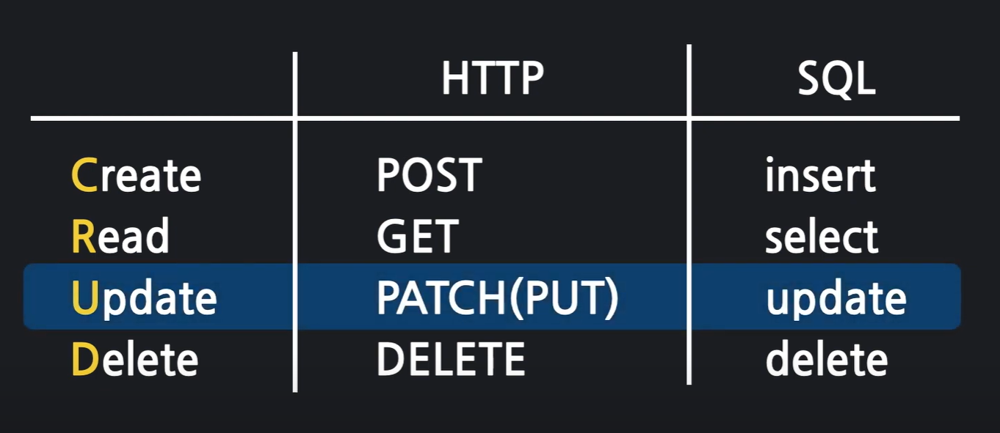
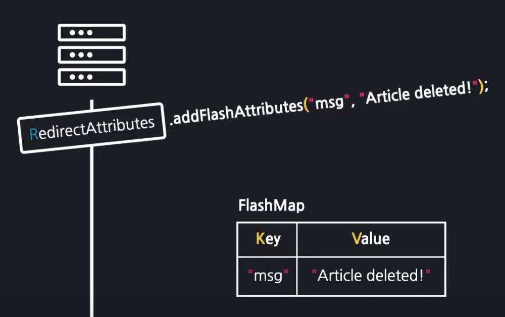
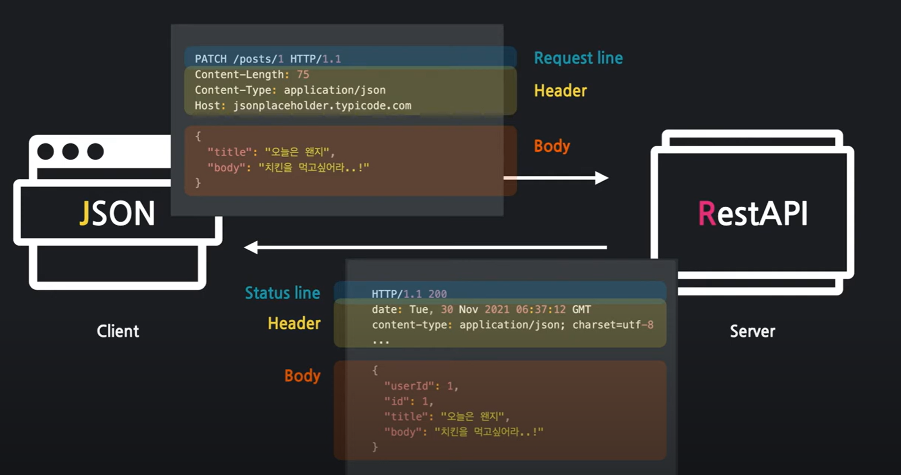
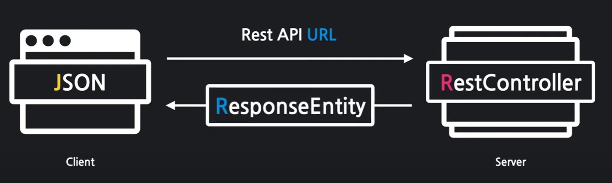
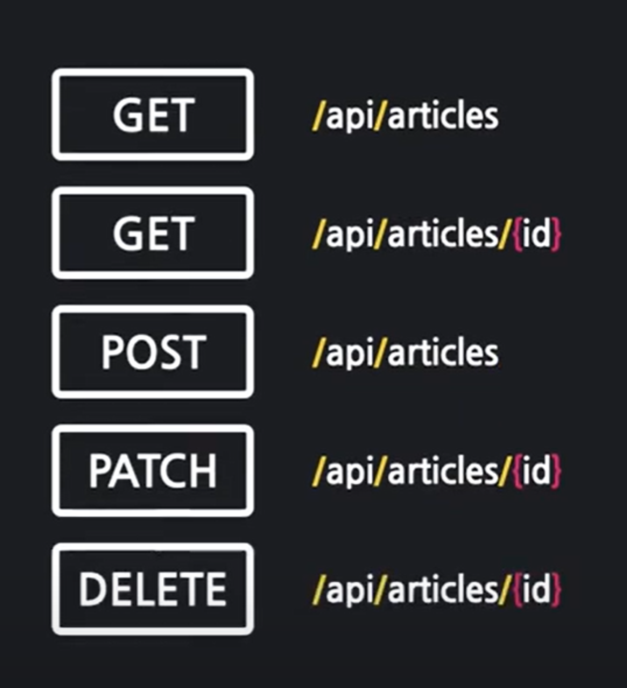
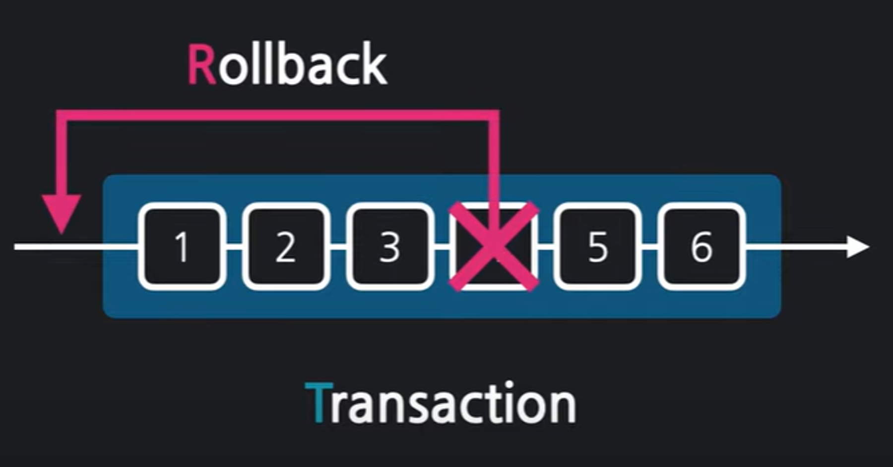

# SpringBoot

# 2장 MVC 패턴 이해와 실습

## MVC패턴 활용해 뷰 템플릿 페이지 만들기


### mustache(뷰)

뷰템플릿을 만드는 도구=뷰 템플릿 엔진

src > main > resources > templates에 머스테치 파일 저장하면 스프링부트에서 자동으로 로딩

제일 윗줄에 doc 입력 후 tab키 누르면 기본 html코드 자동으로 작성됨

이 페이지를 웹에서 보려면 컨트롤러, 모델 이용해야함

### 컨트롤러

src > main > java디렉터리의 기본 패키지 안에 컨트롤러 패키지로 생성

기본으로 입력된 패키지명 뒤에 controller  추가, 해당 패키지 안에 ###Controller Class 생성

이 클래스가 컨트롤러임을 선언하는 `@Controller` 어노테이션 작성, 뷰 반환할 메서드 생성 후 return문 안에 mustache 페이지 반환

Controller Class안에 `@GetMapping` 으로 URL주소 반환

### 모델 추가

컨트롤러 메서드의 매개변수로 받아옴

뷰템플릿에 변수 삽입 `{{변수명}}` 

뷰 반환하는 메서드에 Model 타입의 model 매개변수 추가

`model.addAttribute("변수명", "변숫값")`  : 모델에서 변수를 등록하는 메서드

### MVC 패턴 실습 요약


# 3장 게시판 만들고 새 글 작성하기: Create

## 3.1 폼데이터란

`폼데이터`: html 요소인 < form>태그에 실려 전송되는 데이터

`<form> 태그` : 웹프라우저에서 서버로 데이터를 전송할 때 사용, 데이터를 전송할때 어디로, 어떻게 보낼지 등을 적어서 보냄
< form>태그에 실어 보낸 데이터는 서버의 컨트롤러가 객체에 담아서 받음

`DTO`: data transfer object, < form>태그에 실어보낸 데이터를 담아 받는 서버 컨트롤러의 객체, DTO로 받은 데이터는 최종적으로 데이터페이스에 저장됨

## 3.2 폼데이터 DTO로 받기

### \<form>태그 속성

- action: 어디로 보낼지에 관한 정보, URL 연결 주소. ex) `action="/articles/create"` 해당 페이지로 폼데이터를 보낸다는 의미
- method: 어떻게 보낼지에 관한 정보, 속성값으로 get, post 2가지 설정 가능.

### 폼데이터 받기

뷰페이지에서 폼데이터를 post방식으로 전송하므로 컨트롤러에서 받을때도 `@PostMapping()`으로 받음.

### DTO 만들기

프로젝트 파일에서 new→package 생성 후 dto 패키지 생성 (컨트롤러와 같은 레벨)

새로운 자바 클래스 생성 하면 해당 자바파일이 폼 데이터를 받아올 그릇, DTO가 됨.

입력받는 창만큼의 필드 갯수 필요. 생성자와 toString 메서드 추가

### 폼데이터 DTO에 담기

DTO클래스를 컨트롤러 메서드의 매개변수로 받아옴, form 객체를 매개변수로 선언

### 입력폼과 DTO 필드 연결

mustache 입력폼에 필드명 지정하면 해당 입력폼이 DTO의 필드와 연결됨

### 요약

1. 뷰페이지 만들기 (form action, method 지정)
2. 컨트롤러 만들기 (PostMapping으로 URL 주소 연결)
3. DTO 만들기
4. 컨트롤러에서 폼 데이터 전송받아 DTO 객체에 담기

## 3.3 DTO를 데이터 베이스에 저장하기

`데이터베이스`: 데이터를 관리하는 창고, DB의 모든 데이터는 행과 열로 구성된 테이블에 저장해 관리

`JPA`: 자바 언어로 DB에 명령을 내리는 도구, 데이터를 객체 지향적으로 관리할 수 있게 해줌

`엔티티`: 자바 객체가 DB를 이해할 수 있게 만든 것, 이를 기반으로 테이블이 만들어짐

`리파지터리`: 엔티티가 DB속 테이블에 저장 및 관리될 수 있게 하는 인터페이스

폼 데이터를 DB에 저장하려면
1. DTO를 엔티티로 변환하기
2. 리파지터리를 이용해 엔티티를 DB에 저장하기

### DTO를 엔티티로 변환하기
`Article article = form.toEntity();` // form 객체의 toEntity() 메서드 호출, 그 반환 값을 Article 타입의 article 엔티티에 저장

`Article 클래스 만들기`: 프로젝트에 `entity` 패키지 만든 후 클래스 생성
1. `@Entity` 어노테이션 붙이기
2. `@Column` 어노테이션 붙이고 필드 생성
3. 대푯값 `@Id`로 선언 후 `@GeneratedValue`로 대푯값 자동 생성 -> 대푯값으로 중복된 데이터 있더라도 구분 가능
4. 생성자와 toString() 메서드 생성

`toEntity()`메서드 생성: DTO인 form 객체를 엔티티 객체로 변환하는 역할
1. `ArticleForm` (DTO 클래스)에 toEntity() 메서드 추가
2. DTO 객체 엔티티로 반환, `return new Article(null, title, content);` //id정보 제외한 ArticleForm 객체의 전달값 입력

### 리파지터리로 엔티티를 DB에 저장하기
1. 컨트롤러 필드 선언부에 리파지터리 객체 선언
2. `Article saved = articleRepository.save();` // save() 메서드 호출해 article 엔티티 저장. save() 메서드는 저장된 엔티티를 반환하여 Article 타입의 saved라는 객체에 받아옴 

`리파지터리 만들기`: 인터페이스 생성

1. 프로젝트에 `repository` 패키지 생성, `ArticleRepository` 인터페이스 생성
2. JPA에서 제공하는 인터페이스 활용. 리파지터리 이름 뒤에`extend CrudRepository<T, ID>` 선택, <> 안에 2개의 제네릭 요소를 받음
   1. `Article`: 관리 대상 엔티티의 클래스 타입, 여기서는 Article
   2. `Long`: 관리 대상 엔티티의 대푯값 타입. id가 대푯값이므로 Long타입 입력

`객체 주입하기`: 스프링 부트는 객체를 만들지 않아도 미리 생성해놓은 객체 가져다 연결해서 사용 가능

**의존성 주입(DI)**: 컨트롤러 클래스에 `@AutoWired` 어노테이션 붙이면 스프링부트가 만들어놓은 객체 가져와 주입

## 3.4 DB데이터 주입하기
### CRUD
`create`: 생성 `read` : 조회 `update` : 수정 `delete` : 삭제, CRUD 조작은 SQL로 수행
### H2 DB 접속하기
src > main > resources > application.properties에 `spring.h2.console.enabled=true` 작성

`localhost:8080/h2-console` 접속, RUN 탭에서 jdbc 주소 찾은 후 JDBC URL에 붙여 넣고 Connect
### SELECT문: 테이블의 속성 조회
`SELECT 속성명 FROM 테이블명;`

속성명 대신 * 사용 시 모든 속성을 조회하라는 뜻
### INSERT문: 테이블에 데이터(레코드) 직접 삽입
`INSERT INTO 테이블명(속셩명1, 속성명2, 속성명3, ...) VALUES (값1, 값2, 값3, ...);`

# 4장 롬복과 리팩터링
## 4.1 롬복이란
`롬복`: 코드를 간소화해주는 라이브러리, 필수 콛를 간편하게 작성할 수 있음

`로깅`: 프로그램의 수행 과정을 기록으로 남기는 것

`리팩터링`: 코드의 기능에는 변함없이 코드의 구조 또는 성능을 개선하는 작업

## 4.2 롬복을 활용해 리팩터링하기
`@AllArgsContructor`: 생성자 어노테이션

`@ToString`: toString() 메소드 어노테이션

`@Slf4j`: 로깅을 위한 어노테이션, Simple Logging Facade for Java의 약자

`log.info()`: 컨트롤러에 print문 대신 로그 남기기 위해 사용

# 5장 게시글 읽기: Read
### 5.1 데이터 조회 과정


### 5.2 단일 데이터 조회
``` java
@GetMapping("/articles/{id}")
public String show(@PathVariable Long id, Model model){
        log.info("id =" + id); // id를 잘 받았는지 확인하는 로그 찍기
        // 1. id를 조회해 데이터 가져오기
        Article articleEntity = articleRepository.findById(id).orElse(null); //.orElse(null) 붙히지 않고 Article 대신 Optional<Article> 넣어도 됨
        // 2. 모델에 데이터 등록하기
        model.addAttribute("article", articleEntity); // article이라는 이름으로 articleEntity 객체 등록
        // 3. 뷰 페이지 반환하기
        return "articles/show";
        }
```
``` mustache 
{{>layouts/header}}
<table class="table">
    <thead>
    <tr>
        <th scope="col">Id</th>
        <th scope="col">Title</th>
        <th scope="col">Content</th>
    </tr>
    </thead>
    <tbody>
    {{#article}}
    <tr>
        <th>{{id}}</th>
        <td>{{title}}</td>
        <td>{{content}}</td>
    </tr>
    {{/article}}
    </tbody>
</table>
{{>layouts/footer}}
```

### 5.3 데이터 목록 조회
``` java
@GetMapping("/articles")
    public String index(Model model) {
        // 1. 모든 데이터 가져오기
        List<Article> articleEntityList = articleRepository.findAll();
        // 2. 모델에 데이터 등록하기
        model.addAttribute("articleList", articleEntityList);
        // 3. 뷰 페이지 설정하기
        return "articles/index";
    }
```

``` mustache
{{>layouts/header}}
<table class="table">
    <thead>
    <tr>
        <th scope="col">Id</th>
        <th scope="col">Title</th>
        <th scope="col">Content</th>
    </tr>
    </thead>
    <tbody>
    {{#articleList}}
        <tr>
            <th>{{id}}</th>
            <td>{{title}}</td>
            <td>{{content}}</td>
        </tr>
    {{/articleList}}
    </tbody>
</table>
{{>layouts/footer}}
```

# 6장 게시판 내 페이지 이동하기
`링크`: 미리 정해 놓은 요청을 간편하게 전송하는 기능, 페이지 이동을 위해 사용. HTML의 &lt;a> 태그 혹은 &lt;form> 태그로 작성, 클라이언트가 링크를 통해 어느 페이지로 이동하겠다고 요청하면 서버는 결과 페이지를 응답

`리다이렉트`: 클라이언트가 보낸 요청을 마친 후 계속해서 처리할 다음 요청 주소를 재지시, 리다이렉트를 지시받은 클라이언트는 해당 주소로 다시 요청을 보내고 서버는 이에 대한 결과를 응답

`뷰 파일에 링크 걸기`: &lt;a> 태그 이용해 다음과 같은 형식으로 작성
``` html
<a href="URL 주소">링크를 걸 대상</a>
```
`리다이렉트 정의하기`: return문을 사용해 다음과 같은 형식으로 작성
``` java
return "redirect:URL_주소";
```

# 7장 게시글 수정하기: Update
## 7.1 데이터 수정 과정
1. <수정 페이지> 만들고 기존 데이터 불러오기
2. 데이터를 수정해 DB에 반영한 후 결과를 볼 수 있게 <상세페이지>로 리다이렉트하기
## 7.2 <수정 페이지 만들기>
``` java
@GetMapping("/articles/{id}/edit")
    public String edit(@PathVariable Long id, Model model){
        // 수정할 데이터 가져오기
        Article articleEntity = articleRepository.findById(id).orElse(null);
        // 모델에 데이터 등록하기
        model.addAttribute("article", articleEntity);
        // 뷰 페이지 설정하기
        return "articles/edit";
    }
```

```html
value="{{title}}" <!--데이터 불러오기, article.title에서 article 생략 가능-->
<a href="/articles/{{id}}">Back</a> <!--Back 버튼 주소 설정-->
```
### 수정 페이지가 나올 떄까지 처리 흐름
1. 클라이언트로부터 데이터 수정 요청이 들어온다
2. 수정 요청 데이터를 DB에서 찾는다
3. 수정 요청 데이터를 모델에 등록한다
4. 뷰페이지에 수정할 데이터를 함께 보여준다

## 7.3 수정 데이터를 DB에 갱신하기
`MVC`:서버 역할을 분담해 처리하는 기법

`JPA`:서버와 DB 간 소통에 관여하는 기술

`SQL`:DB 데이터를 관리하는 언어

`HTTP`:데이터를 주고받기 위한 통신 규약

`프로토콜`: 컴퓨터 간에 원활하게 통신하기 위해 사용하는 전 세계 표준언어


New -> File -> data.sql 서버를 껐다 켤때마다 데이터 자동으로 삽입됨
``` roomsql
INSERT INTO article(id, title, content) VALUES (1, '가가가가', '1111');
INSERT INTO article(id, title, content) VALUES (2, '나나나나', '2222');
INSERT INTO article(id, title, content) VALUES (3, '다다다다', '3333');
```
`edit.mustache`: action 속성은 폼데이터를 어디로 보낼지 URL 지정, method 속성은 어떻게 보낼지 방식 지정, id는 몇번 article을 수정하는지 알려줘야함
```html
<form class="container" action="/articles/update" method="post">
    <input name="id" type="hidden" value="{{id}}">
```


``` java
@PostMapping("/articles/update")
    public String update(ArticleForm form){ // 매개변수로 DTO 받아오기
        log.info(form.toString());
        // 1. DTO를 엔티티로 변환하기
        Article articleEntity = form.toEntity();
        log.info(articleEntity.toString());
        // 2. 엔티티를 DB에 저장
        // 2-1. DB에서 기존 데이터 가져오기
        Article target = articleRepository.findById(articleEntity.getId()).orElse(null);
        // 2-2. 기존 데이터 값을 갱신하기
        if (target!=null) {
            articleRepository.save(articleEntity); // 엔티티를 DB 저장 (갱신)
        }
        // 3. 수정 결과 페이지로 리다이렉트
        return "redirect:/articles/" + articleEntity.getId();
    }
```
### sql에서 직접 DB 갱신
``` roomsql
UPDATE 테이블명 SET 속성명=변경할_값 WHERE 조건 ;
UPDATE article SET title='가가가', content='나나나' where id='2';
SELECT * FROM article 
```

# [스프링 부트 입문 16] 데이터 삭제하기
`RedirectAttributes`: RedirectAttributes 객체의 addFlashAttribute() 메서드는 리다이렉트된 페이지에서 사용할 일회성 데이터를 등록할 수 있음


``` java 
@GetMapping("/articles/{id}/delete")
    public String delete(@PathVariable Long id, RedirectAttributes rttr){ // id를 매개변수로 가져오기
        log.info("삭제 요청이 들어왔습니다!!");
        // 1. 삭제할 대상 가져오기
        Article target = articleRepository.findById(id).orElse(null); // 데이터 찾기
        log.info(target.toString());
        // 2. 대상 엔티티 삭제하기
        if (target!=null) {
            articleRepository.delete(target);
            rttr.addFlashAttribute("msg", "삭제됐습니다!");
        }
        // 3. 결과 페이지로 리다이렉트하기
        return "redirect:/articles";
    }
```

`addFlashAttribute() 메서드`: 리다이렉트 시점에 한번만 사용할 데이터 등록할 수 있음 (한번 쓰고 사라지는 휘발성 데이터를 등록)
``` java
객체명.addFlashAttribute(넘겨주려는_키_문자열, 넘겨주려는_값_객체);
```

### 삭제 메시지 표시
header.mustache
```html
{{#msg}}
    <div class="alert alert-primary alert-dismissible">
        {{msg}}
        <button type="button" class="btn-close" data-bs-dismiss="alert" aria-label="Close"></button>
    </div>
{{/msg}}
```
### SQL에서 직접 삭제
``` roomsql
DELETE [FROM] 테이블명 WHERE 조건; --[]:생략가능
DELETE article WHERE id=2;
```

# [스프링 부트 입문 17] CRUD와 SQL 쿼리
`쿼리`: DB에 정보를 요청하는 구문

`로깅`: 시스템이 작동할 때 당시의 상태와 작동 정보를 기록하는 것

## JPA 로깅 설정-application.properties

```html
# 17강: JPA 로깅 설정
## 디버그 레벨로 쿼리 출력
logging.level.org.hibernate.SQL=DEBUG
## 이쁘게 보여주기
spring.jpa.properties.hibernate.format_sql=true
## 파라미터 보여주기
logging.level.org.hibernate.type.descriptor.sql.BasicBinder=TRACE
## 고정 url 설정
spring.datasource.url=jdbc:h2:mem:testdb
```

## insert문

```html
insert 
    into
        article
        (content,title,id) 
    values
        (?,?,default)
```

## select문

```html
select
        a1_0.id,
        a1_0.content,
        a1_0.title 
    from
        article a1_0
```

```html
select
        a1_0.id,
        a1_0.content,
        a1_0.title 
    from
        article a1_0 
    where
        a1_0.id=?
```

전체가 아닌 한가지만 선택한 경우→ where

## update문

```html
update
        article 
    set
        content=?,
        title=? 
    where
        id=?
```

## delete문

```html
delete 
    from
        article 
    where
        id=?
```

## table만드는 쿼리문

```html
create table article (
        id bigint generated by default as identity,
        content varchar(255),
        title varchar(255),
        primary key (id)
    )
```

`@GeneratedValue(strategy = GenerationType.*IDENTITY*) // DB가 id를 자동 생성 어노테이션`, id값이 겹치지 않도록 함

# ****[스프링 부트 입문 18] RestAPI와 JSON****

`REST API`: 웹서버의 자원을 클라이언트에 구애받지 않고 사용할 수 있게 하는 설계 방식, http를 이용해 서버의 자원 반환. 이때 서버에서 보내는 응답은 특정 기기에 종속되지 않도록 모든 기기에서 통하는 **데이터**를 반환

`JSON`: 자바스크립트를 이용한 객체 표현식, REST API의 응답 데이터

## HTTP 상태코드

| 상태코드              | 설명                                         |
|-------------------|--------------------------------------------|
| 1XX (정보)          | 요청이 수신돼 처리 중입니다                            |
| 2XX (성공)          | 요청이 정상적으로 처리됐습니다                           |
| 3XX (리다이렉션 메세지)   | 요청을 완료하려면 추가 행동이 필요합니다                     |
| 4XX (클라이언트 요청 오류) | 클라이언트의 요청이 잘못돼 서버가 요청을 수행할 수 없습니다          |
| 5XX (서버 응답 오류)    | 서버 내부에 에러가 발생해 클라이언트 요청에 대해 적절히 수행하지 못했습니다 |

200:응답 성공

404: 찾을 수 없는 페이지 요청

201: 데이터 생성 완료

500: 서버 내부 에러 발생

## HTTP 요청과 응답 구조


# **[스프링 부트 입문 19] HTTP와 RestController**

## REST API 주소 설계



`@RestController`: Rest API용 컨트롤러, JSON 반환 → 데이터를 반환한다 (일반 컨트롤러는 뷰템플릿페이지를 반환)

클라이언트의 데이터 조회, 생성, 수정, 삭제 요청을 HTTP 메서드에 맞게 각각 `@GetMapping`, `@PostMapping`, `@PatchMapping`, `@DeleteMapping` 으로 받아 처리함

`@RequestBody` : JSON 데이터 받기

`HttpStatus`: Http 상태 코드를 관리하는 클래스

`ResponseEntity`: Rest API 요청을 받아 응답할때 HTTP 상태 코드, 헤더, 본문을 실어 보내는 클래스

- 전체 코드

    ``` java
    @Autowired // DI
        private ArticleRepository articleRepository;
    
        // Get
        @GetMapping("/api/articles")
        public List<Article> index() {
            return articleRepository.findAll();
        }
    
        @GetMapping("/api/articles/{id}")
        public Article show(@PathVariable Long id) {
            return articleRepository.findById(id).orElse(null);
        }
    
        // Post
        @PostMapping("api/articles")
        public Article create(@RequestBody ArticleForm dto) {
            Article article = dto.toEntity();
            return articleRepository.save(article);
        }
        // Patch
        @PatchMapping("api/articles/{id}")
        public ResponseEntity<Article> update(@PathVariable Long id, @RequestBody ArticleForm dto) {
            // 1. 수정용 엔티티 생성
            Article article = dto.toEntity();
            log.info("id: {}, article: {}", id, article.toString());
            // 2. 대상 엔티티를 조회
            Article target = articleRepository.findById(id).orElse(null);
            // 3. 잘못된 요청 처리(대상이 없거나 id가 다른 경우)
            if (target == null || id != article.getId()) {
                // 400, 잘못된 요청 응답
                log.info("잘못된 요청! id: {}, article: {}", id, article.toString());
                return ResponseEntity.status(HttpStatus.BAD_REQUEST).body(null);
    
            }
            // 4. 업데이트 및 정상 응답(200)
            target.patch(article); // 뭔가 작성 안하고 수정할 시 그 전 상태 그대로 유지되도록
            Article updated = articleRepository.save(target);
    
            return ResponseEntity.status(HttpStatus.OK).body(updated);
        }
        // Delete
        @DeleteMapping("/api/articles/{id}")
        public ResponseEntity<Article> delete(@PathVariable Long id) {
            // 대상 찾기
            Article target = articleRepository.findById(id).orElse(null);
            // 잘못된 요청 처리
            if (target == null){
                return ResponseEntity.status(HttpStatus.BAD_REQUEST).body(null);
            }
            // 대상 삭제
            articleRepository.delete(target);
            // 데이터 반환
            return ResponseEntity.status(HttpStatus.OK).build();
        }
    ```


# **[스프링 부트 입문 20] 서비스 계층과 트랜잭션**

`서비스`: 컨트롤러와 리파지터리 사이에 위치하는 계층, 처리 업무의 순서를 총괄

`트랜잭션`: 서비스의 업무 처리는 트랜젝션 단위로 진행됨, 모두 성공해야하는 일련의 과정을 뜻함

`롤백`: 트랜잭션 실패 시 진행 초기 단계로 돌리는 것

`@Service`: 해당 어노테이션이 선언된 클래스를 서비스로 인식, 서비스 객체 생성

`@Transaction`: 해당 어노테이션이 선언된 메서드를 트랜잭션으로 묶음, 이렇게 트랜잭션으로 묶인 메서드는 처음부터 끝까지 완전히 실행되거나 아예 실행되지 않거나 둘 중 하나로 동작. 중간에 실패하면 롤백해 처음상태로 되돌아가기 때문

- 컨트롤러 간단하게 표현 가능

    ``` java
    package com.example.firstproject.api;
    
    import com.example.firstproject.dto.ArticleForm;
    import com.example.firstproject.entity.Article;
    import com.example.firstproject.repository.ArticleRepository;
    import com.example.firstproject.service.ArticleService;
    import lombok.extern.slf4j.Slf4j;
    import org.springframework.beans.factory.annotation.Autowired;
    import org.springframework.http.HttpStatus;
    import org.springframework.http.ResponseEntity;
    import org.springframework.web.bind.annotation.*;
    
    import java.util.List;
    @Slf4j
    
    @RestController //RestAPI용 컨트롤러, 데이터(json)을 반환
    public class ArticleApiController {
        @Autowired // DI 생성, 객체를 가져와 연결
        private ArticleService articleService;
    
        // Get
        @GetMapping("/api/articles")
        public List<Article> index() {
            return articleService.index();
        }
    
        @GetMapping("/api/articles/{id}")
        public Article index(@PathVariable Long id) {
            return articleService.show(id);
        }
    
        // Post
        @PostMapping("api/articles")
        public ResponseEntity<Article> create(@RequestBody ArticleForm dto) {
            Article created = articleService.create(dto);
            return (created != null) ?
                    ResponseEntity.status(HttpStatus.OK).body(created) :
                    ResponseEntity.status(HttpStatus.BAD_REQUEST).build();
        }
        // Patch
        @PatchMapping("api/articles/{id}")
        public ResponseEntity<Article> update(@PathVariable Long id, @RequestBody ArticleForm dto) {
            Article updated = articleService.update(id, dto);
            return (updated != null) ?
                    ResponseEntity.status(HttpStatus.OK).body(updated) :
                    ResponseEntity.status(HttpStatus.BAD_REQUEST).build();
        }
        // Delete
        @DeleteMapping("/api/articles/{id}")
        public ResponseEntity<Article> delete(@PathVariable Long id) {
            Article deleted = articleService.delete(id);
            return (deleted!=null) ?
                    ResponseEntity.status(HttpStatus.OK).build() :
                    ResponseEntity.status(HttpStatus.BAD_REQUEST).build();
        }
    
        // 트랜잭션 -> 실패 -> 롤백!
        @PostMapping("/api/transaction-test")
        public ResponseEntity<List<Article>> transactionTest(@RequestBody List<ArticleForm> dtos) {
            List<Article> createdList = articleService.createArticles(dtos);
            return (createdList != null) ?
                    ResponseEntity.status(HttpStatus.OK).body(createdList) :
                    ResponseEntity.status(HttpStatus.BAD_REQUEST).build();
        }
    
    }
    ```

- 서비스 계층에 표현
    ``` java
   package com.example.firstproject.service;
   
   import com.example.firstproject.dto.ArticleForm;
   import com.example.firstproject.entity.Article;
   import com.example.firstproject.repository.ArticleRepository;
   import jakarta.transaction.Transactional;
   import lombok.extern.slf4j.Slf4j;
   import org.springframework.beans.factory.annotation.Autowired;
   import org.springframework.http.HttpStatus;
   import org.springframework.http.ResponseEntity;
   import org.springframework.stereotype.Service;
   
   import java.util.List;
   import java.util.stream.Collectors;
   
   @Slf4j
   @Service // 서비스 선언(서비스 객체를 스프링부트에 생성)
   public class ArticleService {
   @Autowired
   private ArticleRepository articleRepository;
   
       public List<Article> index() {
           return articleRepository.findAll();
       }
   
       public Article show(Long id) {
           return  articleRepository.findById(id).orElse(null);
       }
   
       public Article create(ArticleForm dto) {
           Article article = dto.toEntity();
           if (article.getId()!=null) {
               return null;
           }
           return articleRepository.save(article);
       }
   
       public Article update(Long id, ArticleForm dto) {
           // 1. 수정용 엔티티 생성
           Article article = dto.toEntity();
           log.info("id: {}, article: {}", id, article.toString());
           // 2. 대상 엔티티를 조회
           Article target = articleRepository.findById(id).orElse(null);
           // 3. 잘못된 요청 처리(대상이 없거나 id가 다른 경우)
           if (target == null || id != article.getId()) {
               // 400, 잘못된 요청 응답
               log.info("잘못된 요청! id: {}, article: {}", id, article.toString());
               return null;
           }
           // 4. 업데이트
           target.patch(article); // 뭔가 작성 안하고 수정할 시 그 전 상태 그대로 유지되도록
           Article updated = articleRepository.save(target);
   
           return updated;
       }
   
       public Article delete(Long id) {
           // 대상 찾기
           Article target = articleRepository.findById(id).orElse(null);
           // 잘못된 요청 처리
           if (target == null){
               return null;
           }
           // 대상 삭제 후 반환
           articleRepository.delete(target);
           return target;
       }
   
       @Transactional
       public List<Article> createArticles(List<ArticleForm> dtos) {
           // dto 묶음을 entity 묶음으로 변환
           List<Article> articleList = dtos.stream()
                   .map(dto -> dto.toEntity())
                   .collect(Collectors.toList());
           // entity 묶음을 DB로 저장
           articleList.stream()
                   .forEach(article -> articleRepository.save(article));
           // 강제 예외 발생
           articleRepository.findById(-1L).orElseThrow(
                   () -> new IllegalArgumentException("결제 실패!")
           );
           // 결과값 반환
            return articleList;
       }
   }
   ```
# **[스프링 부트 입문 21] 테스트 작성하기**
`테스트`:프로그램의 품질 검증을 위함, 의도대로 프로그램이 동작하는지 확인하는 것

`테스트케이스`:성공과 실패로 나뉨, 조건에 따라 다양한 경우로 작성될 수 있음

`TDD`:테스트를 통한 코드 검증과 리팩터링을 기반으로 한 개발 방법론인 테스트 주도 개발. 테스트 코드를 만든 후 이를 통과하는 최소한의 코드부터 시작해 점진적으로 코드를 개선 및 확장해나가는 개발방식


성공하면 리팩터링, 실패하면 디버깅

`@SpringBootTest`: 스프링 부트 환경과 연동된 테스트를 위한 어노테이션

`@Transactional`:데이터 조회 외의 경우(생성, 변경, 삭제)에는 트랜잭션 처리를 통해 롤백하도록 해야 함

# **[스프링 부트 입문 22] 댓글 엔티티와 리파지터리(feat. 테스트)**
